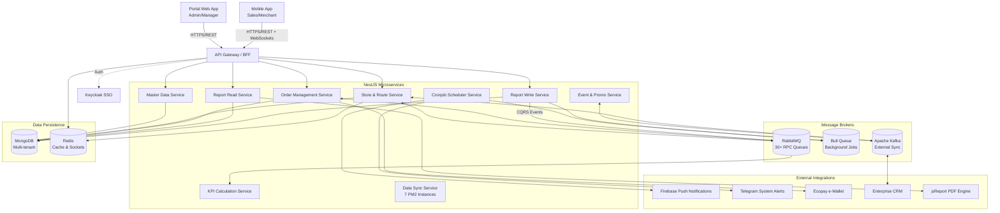

# Architecture & Infrastructure

The Finviet DMS backend is structured as a **NestJS Monorepo** containing **15 distinct microservices**. This architecture is designed to handle high concurrency from thousands of sales personnel executing GPS-verified check-ins, while isolating complex background jobs and data synchronization.

## High-Level Architecture Diagram

## Architectural Components

### 1. Multi-Queue Message Architecture
The system relies on three distinct message brokers to decouple services and ensure reliability:
- **RabbitMQ:** Configured with over 30 queues, serving as the primary nervous system for inter-service RPC (Remote Procedure Call) communication.
- **Bull Queue:** Utilized for heavy, asynchronous background processing such as Excel imports/exports and batch updates.
- **Apache Kafka:** Dedicated to high-throughput external data synchronization, specifically streaming events to the legacy Enterprise CRM and third-party promotion engines.

### 2. CQRS Pattern (Command Query Responsibility Segregation)
Due to the massive volume of daily check-ins, tasks, and KPI calculations, the reporting architecture separates write and read operations:
- `report-write-service` handles all incoming transactional data from sales activities.
- Data is published to RabbitMQ.
- `report-kpi-service` consumes these events to aggregate and calculate KPIs in real-time.
- `report-read-service` serves highly optimized, read-only materialized views directly to the manager dashboards via API.

### 3. CI/CD & Deployment Strategy
The infrastructure is fully containerized and leverages modern DevOps practices:
1. **Source Control:** GitLab triggers CI pipelines on tag creation.
2. **Build:** Docker images are built individually for each of the 15 microservices.
3. **Registry:** Images are pushed to Google Cloud Platform (GCP) Artifact Registry.
4. **Orchestration:** Kubernetes (K8s) manages the container lifecycle.
5. **Deployment:** ArgoCD continuously monitors the registry and Git state to perform automated, declarative deployments to the K8s clusters.

### 4. Security & Data Isolation
- **Keycloak SSO:** Centralized identity and access management.
- **RBAC via ACL Module:** Fine-grained Access Control Lists determine exactly which features Sales, Group Managers, and Senior Managers can access.
- **Multi-tenant MongoDB:** Data isolation is enforced at the database level through company-scoped schema designs, ensuring zero cross-contamination between different enterprise clients using the platform.
