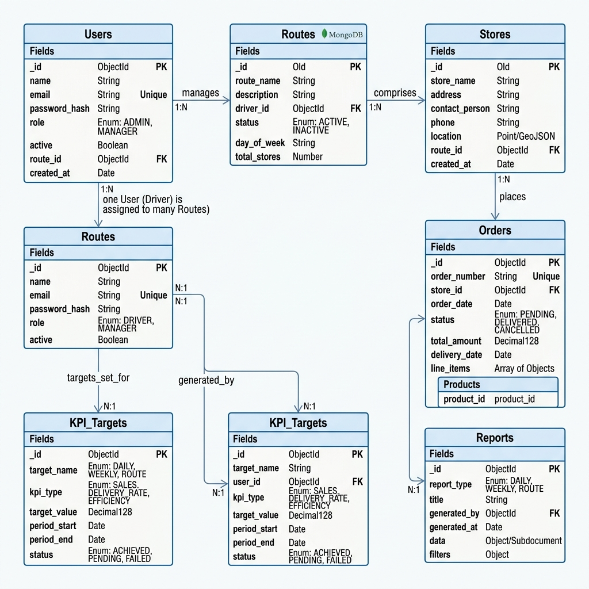

# Entity-Relationship (ER) Diagram

The DMS database utilizes MongoDB, engineered for multi-tenant data isolation and high-volume transaction processing. Below is a structural representation of the core collections and their relationships.

## Core Collections Overview

| Collection | Purpose | Key Fields | Relationships |
|------------|---------|------------|---------------|
| **Users** | Stores all system actors (Sales, Managers, Admins) and handles Keycloak SSO linkage. | `_id`, `name`, `email`, `role`, `active`, `route_id` (FK) | 1:N with Routes |
| **Stores (Merchants)** | Represents physical store locations, their metadata, and geospatial data for check-ins. | `_id`, `store_name`, `location` (GeoJSON), `contact_person`, `route_id` (FK) | 1:N with Orders |
| **Routes** | Defines the planned daily/weekly visit paths assigned to Sales personnel. | `_id`, `route_name`, `driver_id` (FK), `status`, `day_of_week` | N:1 with Users, 1:N with Stores |
| **Orders** | Records transactional purchase data initiated by Sales (on behalf of stores) or directly by Merchants. | `_id`, `order_number`, `store_id` (FK), `status`, `total_amount`, `line_items` | N:1 with Stores |
| **KPI_Targets** | Stores the goal metrics (daily, weekly, monthly) assigned by managers to sales groups or individuals. | `_id`, `target_name`, `user_id` (FK), `kpi_type`, `target_value`, `status` | N:1 with Users |
| **Reports** | Houses the pre-calculated, materialized views generated by the CQRS pipeline for lightning-fast dashboard rendering. | `_id`, `report_type`, `title`, `generated_by` (FK), `data` (Subdocument) | N:1 with Users |

## Database Design Notes

1. **Multi-tenancy:** Data isolation is maintained rigorously. Depending on the enterprise client scale, isolation is handled either via tenant-ID filtering within collections or through entirely separate logical databases.
2. **Geospatial Indexing:** The `Stores` collection leverages MongoDB's `2dsphere` indexes on the `location` field. This is critical for the Mobile App to quickly verify if a salesperson is within the acceptable GPS radius of a store during the check-in process.
3. **CQRS Optimization:** The `Reports` collection represents the "Read" side of the CQRS architecture. It stores heavily aggregated, denormalized documents prepared by the `report-kpi-service` to prevent expensive runtime calculations on the Manager dashboards.
