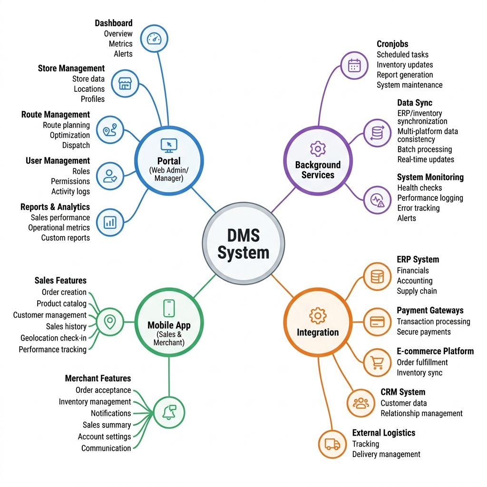

# Functional Map

The following functional mind-map illustrates the comprehensive feature set of the DMS System, categorized by the platform (Portal vs Mobile) and the supporting infrastructure (Background Services & Integrations).

## Feature Hierarchy

### 1. Portal (Web — Admin/Manager)
The web portal serves as the command center for Senior Managers and Group Sales Managers.

- **Dashboard & KPI:** Granular tracking of KPIs by time (day/week/month), category, product brand, and route. Includes tools for assigning KPI targets.
- **Store Management:** Complete lifecycle management for merchant stores, including detail tracking, survey data, and real-time inventory views.
- **Route Management:** Tools to create, edit, and assign visit schedules (frequencies) to sales personnel, supplemented by real-time GPS route tracking.
- **Order & Product Management:** Processing orders, managing the product catalog, and handling bulk imports via Excel.
- **User & Role Management:** Employee monitoring, Role-Based Access Control (RBAC), and grouping (e.g., area groups).
- **Reports & Export:** Generation of daily/monthly summaries, team KPI reports, and execution of bulk PDF/Excel exports via jsReport and background ZIP compression.

### 2. Mobile App (Sales & Merchant)
The mobile application provides tailored experiences for two distinct end-users.

**Sales Features:**
- GPS-verified store check-in and check-out.
- Dynamic route planning for today and future dates.
- Task execution during visits (e.g., photo uploads, surveys, order placement, inventory checks).
- Real-time personal KPI tracking.

**Merchant Features:**
- Direct browsing and ordering of products from distributors.
- Checking real-time inventory stock levels.

### 3. Background Services
Critical asynchronous operations that maintain system integrity without blocking user interfaces.

- **Cronjob Service (Nightly Data Pipeline):** Orchestrates a complex sequence of tasks from 23:59 to 07:00, including auto-checkout, expired route marking, new route generation, and ZIP report compression.
- **Report Sync Service:** Runs 7 parallel PM2 instances to synchronize distinct data types (Master data, Stores, Routes, Events, Orders, Checksums, Inventory).

### 4. Integrations
External systems connected to the DMS ecosystem:
- **Keycloak SSO:** Centralized identity management.
- **Firebase & Telegram:** Push notifications and system-critical alerts.
- **Ecopay:** e-Wallet payment processing integration.
- **Enterprise CRM & Promo Systems:** Data synchronization via Apache Kafka.
