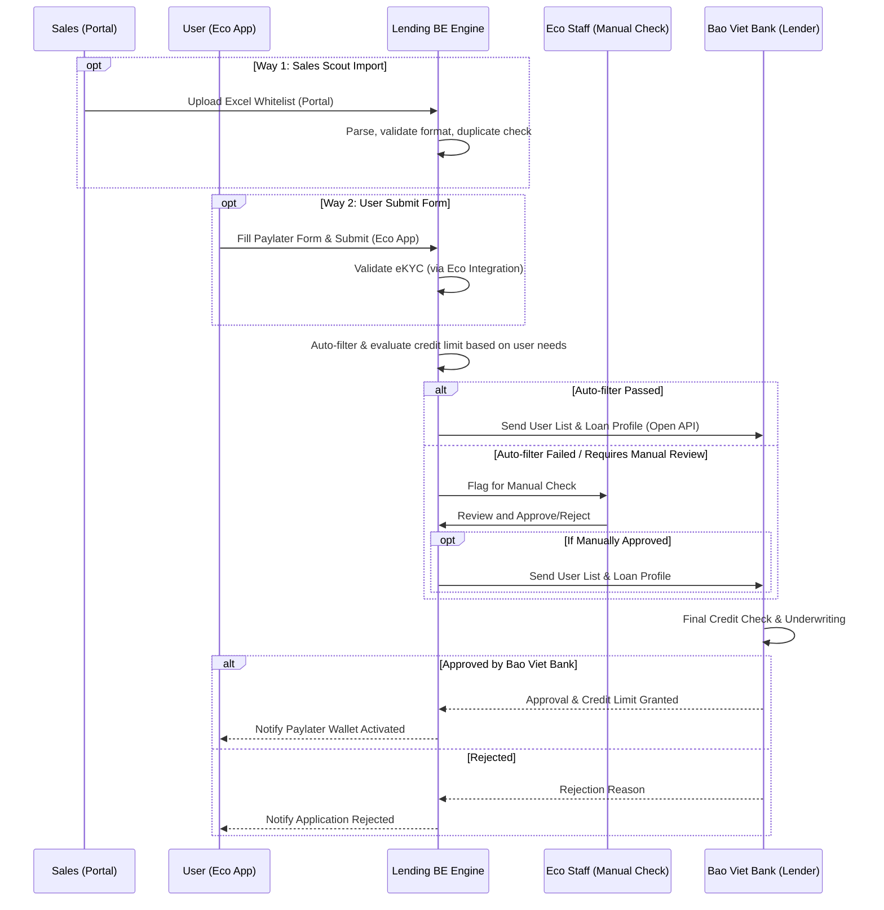
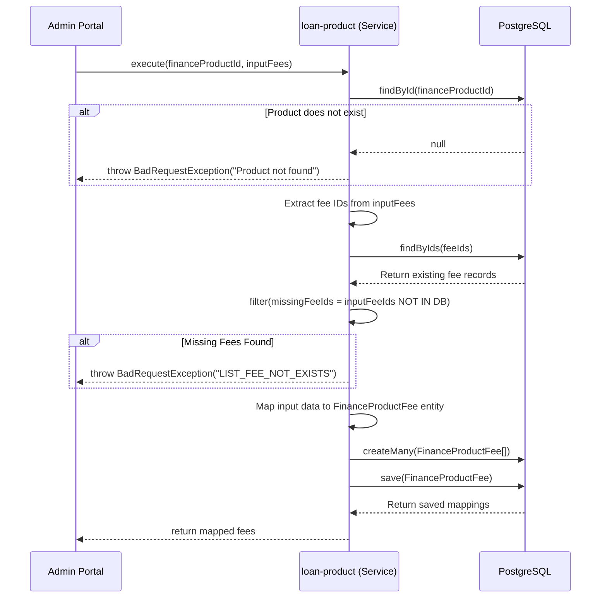
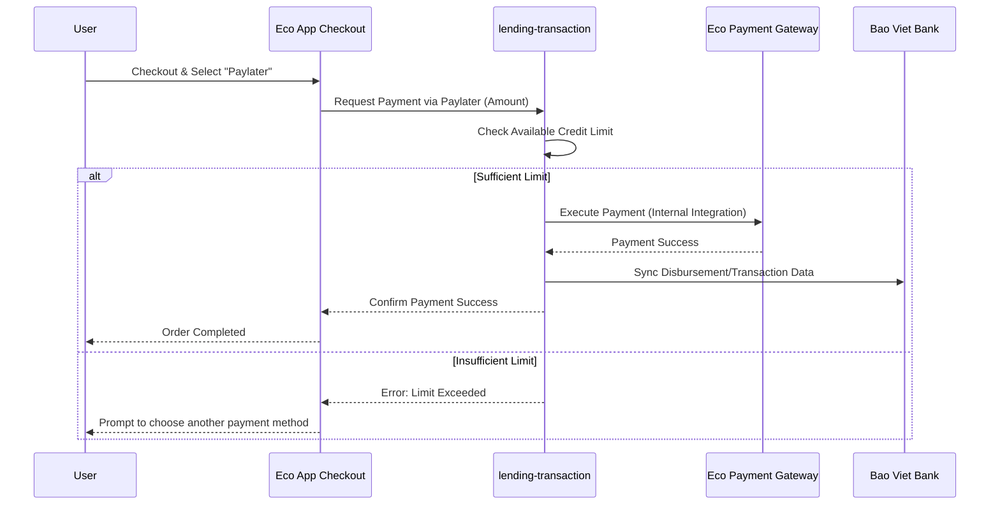
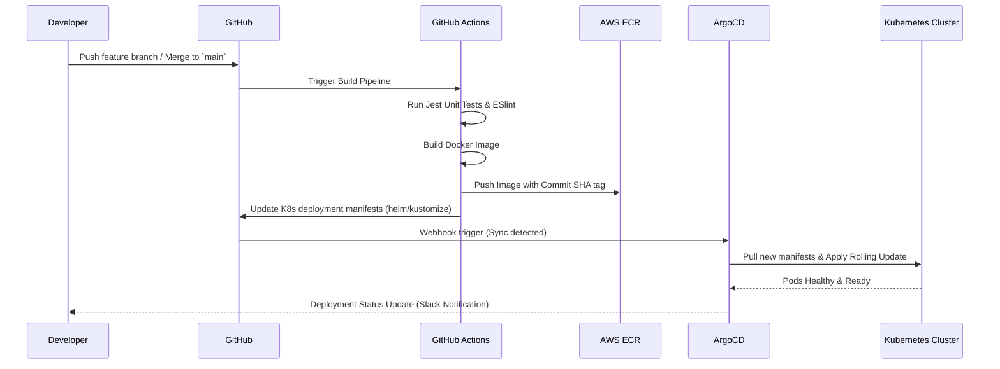

# Key API & Request Lifecycles

## 1. Whitelist & Loan Application Flow (Bao Viet Bank Integration)
This flow handles the two primary ways users can enter the Lending ecosystem, get evaluated, and receive credit lines sponsored by **Bao Viet Bank**.

## 2. Dynamic Fee Execution & Validation Flow
This process links configurable fee structures dynamically to a specific Finance Product.

## 3. Paylater Purchase Flow (Payment Integration)
This flow explains how a user utilizes their granted Paylater credit to make a purchase within the Eco App.

## 4. CI/CD Deployment Flow
The automated pipeline ensuring zero-downtime deployment for all Lending microservices across environments.

