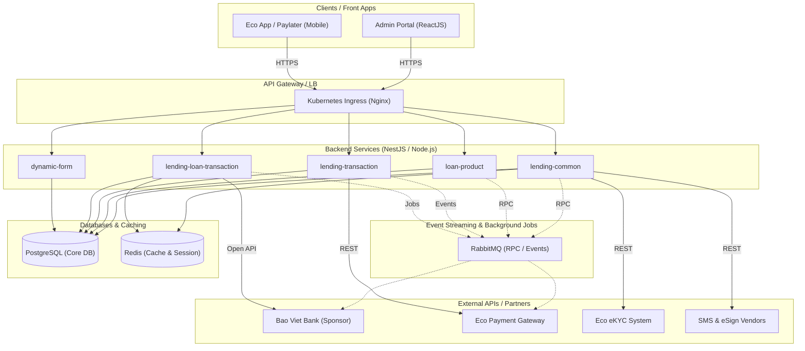
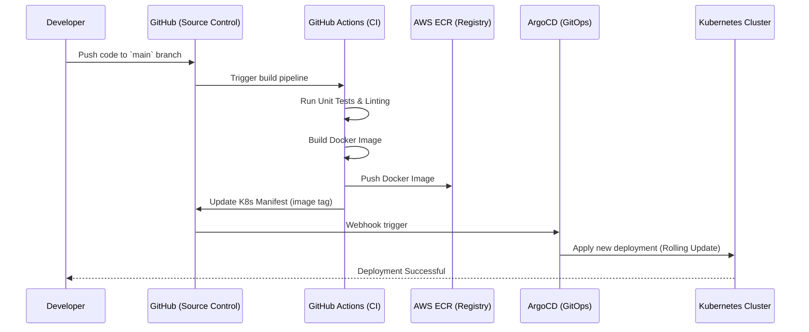

# System Architecture

## High-Level Architecture Diagram

## Microservices Breakdown

The backend is built using a Microservices architecture on **NestJS**. Below are the key services and their responsibilities:

1. **`lending-common`**: Handles cross-cutting concerns, shared modules, utility integrations (SMS, eSign, user management, eKYC integration with Eco), and generic customer management logic (Whitelist imports).
2. **`loan-product`**: The configuration engine. Manages product setups, document mapping, fee mapping, supplier mapping, and parameter configurations. 
3. **`lending-loan-transaction`**: Core engine handling the loan lifecycle, auto-filtering logic (scoring and credit granting based on needs), application submission to Bao Viet Bank, and managing loan applications.
4. **`lending-transaction`**: Handles reconciliation, settlement, and integrates with the in-house Eco Payment system for disbursements and Paylater purchases.
5. **`dynamic-form`**: Manages the dynamic creation of onboarding forms, eKYC steps, and document collection workflows based on lender specifications.

## Deployment Flow

The system uses a robust CI/CD pipeline leveraging Docker, Kubernetes, and GitHub Actions.

### Security Considerations
1. **API Security:** All endpoints are protected via JWT. Inter-service communication is secured within the private Kubernetes network.
2. **Data Encryption:** Sensitive PII (Personally Identifiable Information) and financial records are encrypted at rest in PostgreSQL.
3. **Multi-tenant Isolation:** Lender-specific configurations and whitelist data are logically separated using strict database design and role-based access control.
