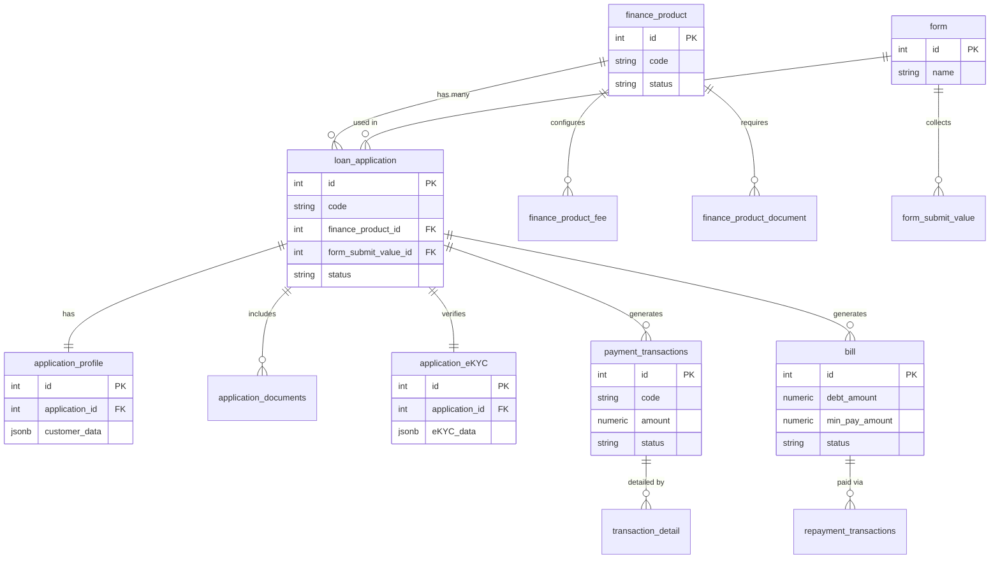

# Database Design — ER Diagram

## Microservice Database Segregation

The system is highly decoupled. Each microservice manages its own separate database schema to ensure domain isolation.

### 1. Loan Product Service Database
Contains the core configurations for financial products, fees, and whitelists.
- **`finance_product`**: The main entity defining a loan product.
- **`finance_product_fee`**: Maps fees to a specific product.
- **`document_set` & `finance_product_document`**: Defines KYC/Onboarding documents required per product.
- **`whitelist`**: Stores eligible customers who can apply for specific products.

### 2. Dynamic Form Service Database
Manages dynamic UI form generation based on product and lender requirements.
- **`form`**: Defines a dynamic form (e.g., Onboarding Form).
- **`form_submit_value`**: Stores the raw JSON responses submitted by the user.

### 3. Loan Application Service Database
Handles the entire user application journey and tracking.
- **`loan_application`**: Tracks the state of an active loan application.
- **`application_profile`**: Customer's submitted demographic and financial profile.
- **`application_documents`**: Links to uploaded files (ID card, selfie) for the application.
- **`application_eKYC`**: Stores the eKYC validation results and scores.
- **`application_aggrements`**: Stores signed digital contracts.

### 4. Loan Transaction Service Database
Manages money movement, ledger tracking, and payment integrations.
- **`payment_transactions`**: Tracks Paylater purchase transactions executed via EcoPay.
- **`transaction_detail`**: Deep breakdown of a transaction (amounts, fees, VAT).
- **`bill` & `bill_detail`**: Manages the monthly statement generated for the user.
- **`repayment_transactions`**: Tracks user repayments towards their outstanding balance.
- **`partner_log`**: Audit log of all API requests and responses sent to Bao Viet Bank and EcoPay.

---

## High-Level ER Diagram (Core Entities)

