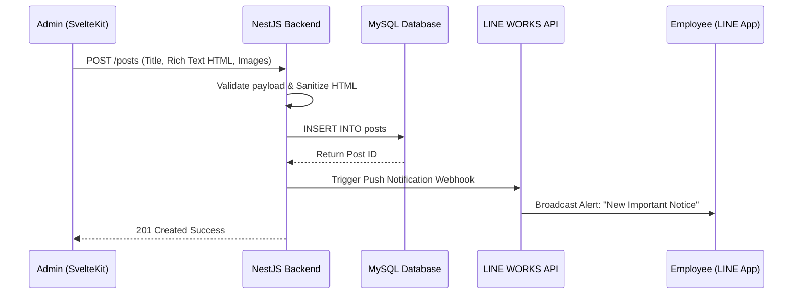
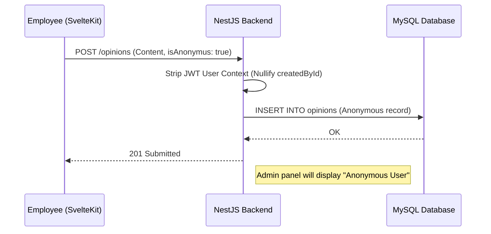
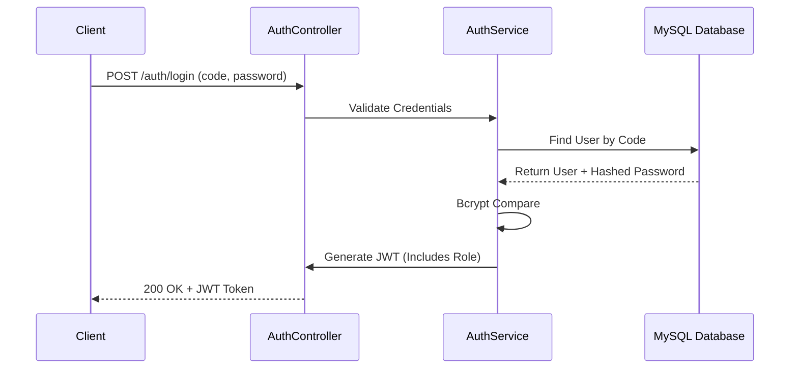

# Key API & Request Lifecycles

## 1. Content Publication & LINE WORKS Broadcast Flow
This is the core flow for administrators pushing critical information down the corporate ladder.

## 2. Secure Anonymous Feedback Flow
This flow empowers employees to report issues or suggest improvements without fear of reprisal.

## 3. JWT RBAC Authentication Flow
A clean authentication mechanism optimized for internal environments using strict Employee Codes rather than vulnerable email addresses.

