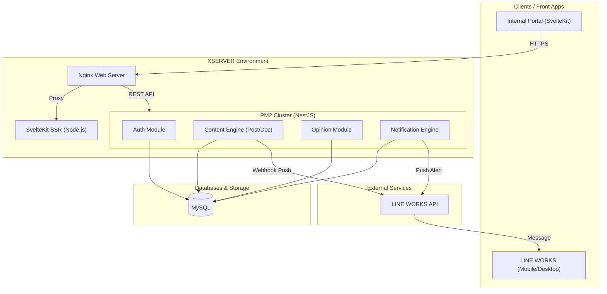

# System Architecture

## High-Level Architecture Diagram

## Technology Stack Breakdown

### 1. Frontend: SvelteKit
- **Framework**: SvelteKit and Vite.
- **Rich Text Engine**: Integrated **Tiptap** for a robust, block-based WYSIWYG editor allowing Admin staff to craft complex manuals and policies with embedded media.
- **Performance**: Server-Side Rendering (SSR) via Node.js adapter for fast initial loads on corporate devices.

### 2. Backend: NestJS & MySQL
- **Framework**: NestJS (TypeScript).
- **ORM**: TypeORM interacting with a strictly relational MySQL database.
- **Security**: Passport-JWT for stateless authentication. Passwords hashed via Bcrypt.

### 3. Third-Party Integrations: LINE WORKS
- Utilized LINE WORKS Messaging API to push critical notifications (e.g., Disaster/Crisis management manuals, urgent company notices) directly to employee LINE accounts.

### 4. DevOps & Infrastructure: XSERVER
- **Hosting**: Deployed on a high-performance **XSERVER** Linux environment.
- **Process Management**: Backend is clustered and daemonized using **PM2**, ensuring zero downtime during deployments and automatic restarts on crash.
- **CI/CD**: Fully automated pipeline via **GitHub Actions**. Upon push to the `main` branch, the pipeline builds the SvelteKit frontend and NestJS backend, securely transferring artifacts to XSERVER and running zero-downtime PM2 reloads.
