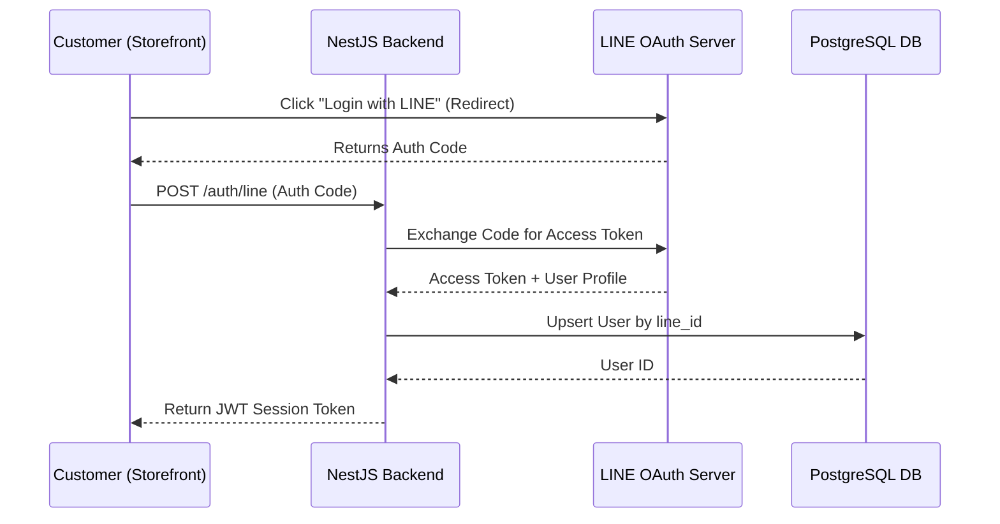
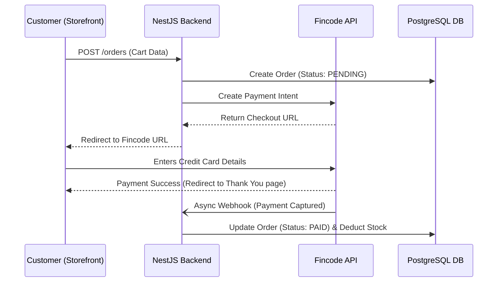
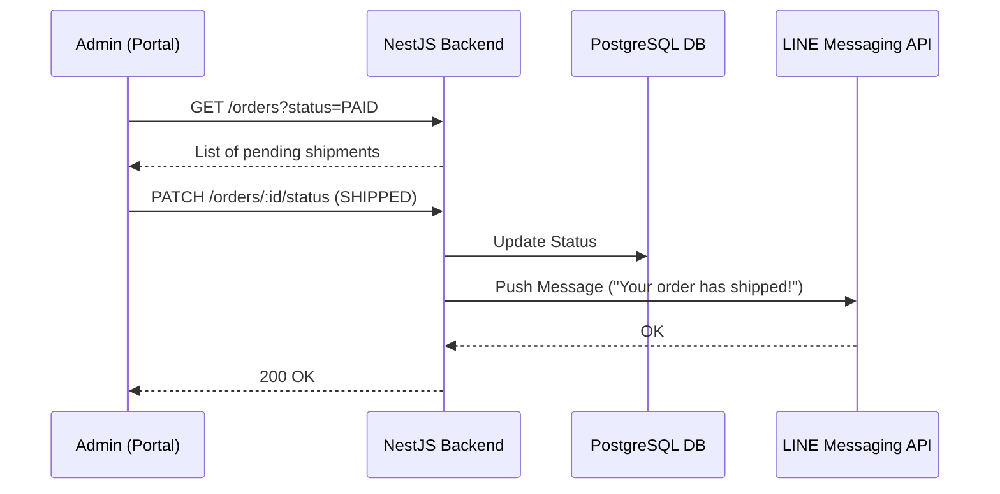

# Key API & Request Lifecycles

## 1. LINE SSO Authentication Flow (Storefront)
Designed to drastically reduce the friction of account creation for new customers.

## 2. Checkout & Fincode Payment Webhook Flow (Storefront)
Ensures payments are securely captured without blocking the main application thread, utilizing asynchronous webhooks.

## 3. Order Fulfillment Flow (Admin Portal)
The operational flow for store managers to process and ship orders, keeping the customer informed via LINE.

