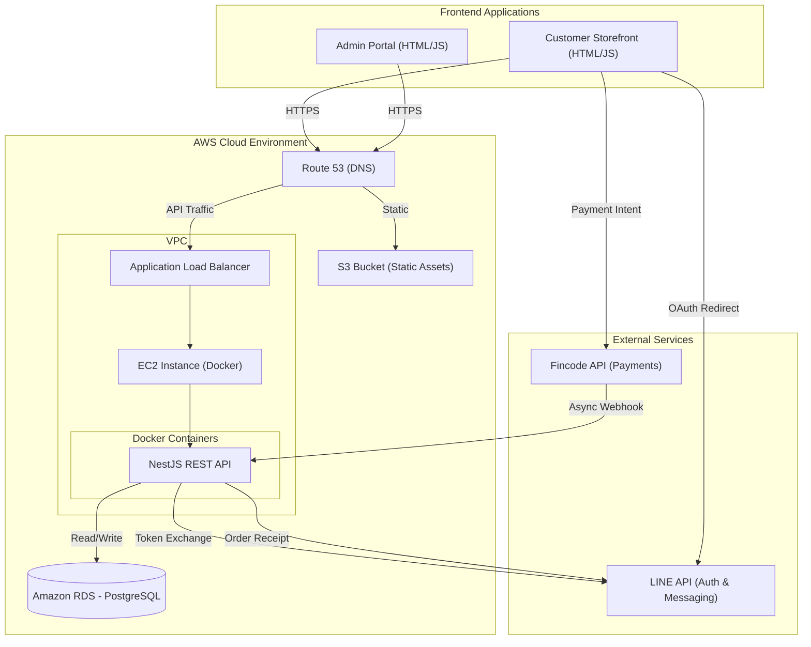

# System Architecture

## High-Level Architecture Diagram

## Technology Stack Breakdown

### 1. Dual-Frontend Strategy
- **Customer Storefront**: Optimized for mobile and desktop conversions. Handles product browsing, cart state, and triggers LINE SSO and Fincode checkouts.
- **Admin Portal**: A secure internal dashboard for store owners to manage inventory (`products`, `categories`), fulfill `orders`, and track customer data.
- **Cross-Origin Resource Sharing (CORS)**: The NestJS backend is configured to accept requests securely from both distinct frontend domains.

### 2. Backend Core: NestJS & PostgreSQL
- **Framework**: NestJS (TypeScript) acting as the single source of truth for both frontends.
- **Database**: PostgreSQL hosted on Amazon RDS for robust relational data integrity, essential for E-commerce ledgers.

### 3. Third-Party Integrations
- **LINE API**: Dual-purpose integration used for seamless Single Sign-On (SSO) to bypass tedious registration forms, and for sending automated order confirmation messages via LINE Messaging API.
- **Fincode API**: Handles secure credit card processing. The backend listens for asynchronous webhooks from Fincode to safely transition order statuses without risking double-charges or race conditions.

### 4. DevOps: AWS CI/CD
- **Containerization**: The NestJS application is packaged via Docker.
- **Automated Pipeline**: GitHub Actions triggers AWS CodeBuild, pushes images to Amazon ECR, and CodePipeline orchestrates the rolling deployment to the EC2 instances.
