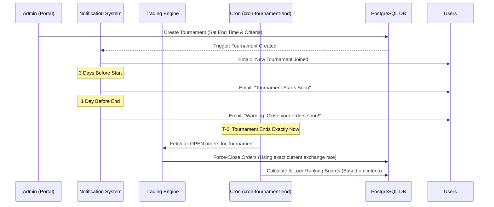
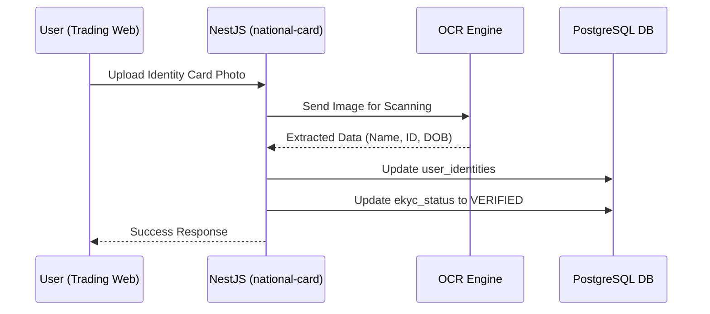
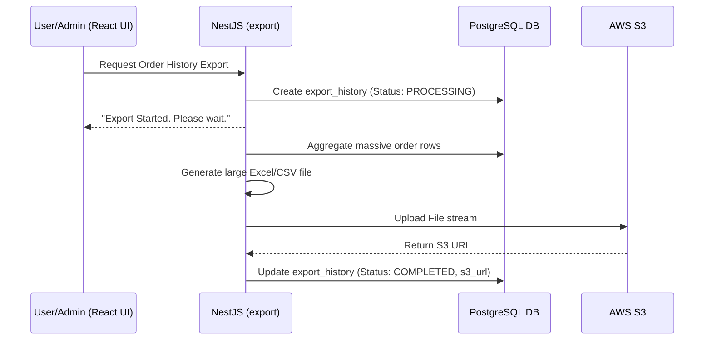

# Key System API & Job Flows

## 1. Automated Tournament Lifecycle (The Core Engine)
This flow highlights the complex orchestration between marketing cronjobs and the high-precision trading engine.

## 2. Asynchronous eKYC Verification Flow
Automating identity verification to reduce Admin workload.

## 3. Scalable Data Export Flow
Designed to prevent memory exhaustion when exporting massive datasets (thousands of trading orders).

