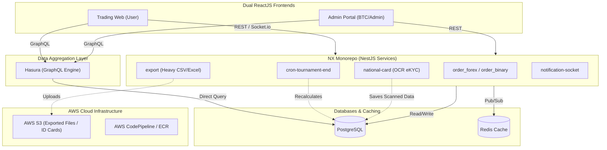

# System Architecture

## High-Level Architecture Diagram

## Technology Stack Breakdown

### 1. Dual ReactJS Frontends
- **Trading Web**: The main application for users to perform eKYC (Identity Card uploads), place real-time trades, monitor tournament rankings, and export personal order histories.
- **Admin Portal**: A dedicated command center for the BTC (Ban Tổ Chức) to configure complex ranking criteria, force-ban users, and extract global system exports.

### 2. The Data Engine: Hasura & PostgreSQL
- **Hasura (GraphQL)**: Sits directly on top of PostgreSQL, providing lightning-fast, auto-generated GraphQL APIs for the React frontends. This dramatically reduces boilerplate code for standard CRUD operations (like viewing leaderboards).

### 3. NestJS Microservices (NX Monorepo)
The core business logic (70% of the backend effort) is split into dozens of isolated NestJS applications managed via an NX workspace (`microservice-v2`):
- **Trading Services (`order_forex`, `order_binary`)**: Validate margins and execute trades.
- **Tournament Schedulers (`cron-tournament-end`)**: High-precision cronjobs that handle the critical T-0 tournament termination logic.
- **eKYC Service (`national-card`)**: Integrates OCR libraries to auto-scan uploaded Identity Cards.
- **Data Exporter (`export`)**: Asynchronous worker dedicated to compiling massive order datasets without blocking the main event loop.

### 4. Real-time Communication: Socket.io & Redis
- **Live Trading**: Socket.io broadcasts live candlestick updates and order status changes to the Trading Web.
- **Instant Admin Actions**: If an Admin bans a user via the Portal, a Redis Pub/Sub event is fired to instantly drop the user's active Socket connection across all instances.

### 5. DevOps & Infrastructure: AWS
- The entire fleet of microservices is containerized via **Docker**.
- Automated deployments are orchestrated via **GitHub Actions** and **AWS CodePipeline**, pushing images to **ECR** and deploying them reliably to **EC2** instances.
